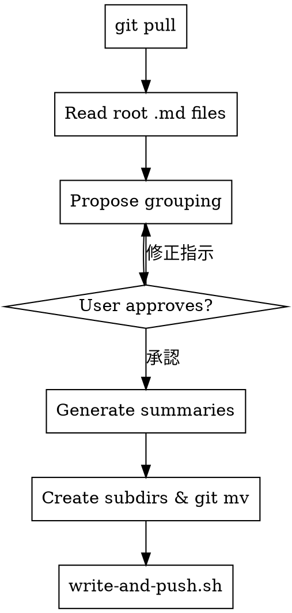

# Obsidian Summarize Skill Implementation Plan

> **For agentic workers:** REQUIRED SUB-SKILL: Use superpowers:subagent-driven-development (recommended) or superpowers:executing-plans to implement this plan task-by-task. Steps use checkbox (`- [ ]`) syntax for tracking.

**Goal:** Create the `01-obsidian-summarize` skill that groups project note files into subdirectories with summary files.

**Architecture:** A single SKILL.md file defines the skill's workflow as natural-language instructions for the Claude agent. The router skill (`01-tasks`) is updated with new triggers and routing. A dotfiles copy is maintained for cross-device sync.

**Tech Stack:** Markdown skill files, Claude Code skill system, git

---

## File Structure

| Action | Path | Responsibility |
|--------|------|----------------|
| Create | `~/.claude/skills/01-obsidian-summarize/SKILL.md` | Skill definition: workflow, template, edge cases |
| Modify | `~/.claude/skills/01-tasks/SKILL.md` | Router: add triggers, routing table row, dot graph node |
| Create | `~/dotfiles/claude/skills/obsidian-summarize/SKILL.md` | Dotfiles sync copy (same content, `name: obsidian-summarize`) |

---

### Task 1: Create the `01-obsidian-summarize` skill

**Files:**
- Create: `~/.claude/skills/01-obsidian-summarize/SKILL.md`

- [ ] **Step 1: Create the skill directory**

```bash
mkdir -p ~/.claude/skills/01-obsidian-summarize
```

- [ ] **Step 2: Write the SKILL.md file**

Create `~/.claude/skills/01-obsidian-summarize/SKILL.md` with the following content:

````markdown
---
name: 01-obsidian-summarize
description: Use when the user wants to group and summarize project notes into organized subdirectories. Triggers on "まとめて", "サマリー", "summarize", "整理して", "ノートをまとめて", "プロジェクトまとめ".
---

# Summarize Project Notes

Obsidian vault (`/Users/naoki/naoki/02_obsidian-vault`) のプロジェクトノートをグルーピングし、サマリーファイルを生成してサブディレクトリに整理する。

## When to Use

- プロジェクトディレクトリのファイルが増えて見づらくなったとき
- ユーザーが明示的に「まとめて」「整理して」と指示したとき

## Workflow



## Steps

The vault is at `/Users/naoki/naoki/02_obsidian-vault`.

1. **Pull latest**
   ```bash
   cd /Users/naoki/naoki/02_obsidian-vault && git pull
   ```

2. **Identify target directory**
   - ユーザーが指定したプロジェクト名から `projects/{project-name}/` を特定
   - ルート直下の `.md` ファイルのみ対象（サブディレクトリ内は対象外）
   - `NNN-` プレフィックスを持つファイルのみ対象（番号なしファイルはスキップ）
   - 対象ファイルが3件未満の場合、グルーピングの意味が薄い旨を伝えて終了

3. **Read all target files**
   - 対象ファイルを全件読む
   - registry.md も読み、インデックステーブルの情報源として使う（registry は読み取りのみ、更新しない）

4. **Propose grouping**
   - 内容の関連性をもとにグルーピングを提案
   - ターミナルに表示する形式:
     ```
     提案:
     1. 001-007: 初期調査とレビュー
        001 全リポジトリ コードレビュー
        002 リポジトリ実装解説
        ...
        007 JWT トークン注入バグ修正
     2. 008-014: 機能実装
        008 Multi-Agent jwt_token 設計分析
        ...
     ```
   - グルーピングは連続番号の範囲で行う（飛び番号にしない）
   - 同一番号の重複ファイルがある場合（例: 010-slides.md と 010-project-summary.md）、同じグループに含める

5. **User approval**
   - ユーザーが承認するまで修正を繰り返す
   - グループ名の変更、グループ分割・統合に対応

6. **Generate summary files**
   - 各グループにつき1つのサマリーファイルを生成
   - ファイル名: `{start}-{end}-{slug}.md`（番号は3桁ゼロ埋め）
   - 内容はテンプレートに従う

7. **Create subdirectories and move files**
   ```bash
   cd /Users/naoki/naoki/02_obsidian-vault
   mkdir -p "projects/{project-name}/{start}-{end}-{slug}"
   git mv "projects/{project-name}/{file}.md" "projects/{project-name}/{start}-{end}-{slug}/"
   ```
   - サブディレクトリ名はサマリーファイルと同名（`.md` なし）

8. **Commit and push**
   ```bash
   /Users/naoki/naoki/02_obsidian-vault/scripts/write-and-push.sh "docs({project}): summarize notes {start}-{end}"
   ```

## Summary File Template

```yaml
---
title: "{start}-{end} {グループ名}"
date: YYYY-MM-DD
project: project-name
type: summary
range: [start, end]
tags: []
---
```

```markdown
## インデックス

| # | タイトル | 日付 | 概要 |
|---|---------|------|------|
| 001 | タイトル | 2026-03-20 | 1行要約 |
| 002 | ... | ... | ... |

## まとめ

グループ全体の流れ・成果・意思決定をまとめた読み物。
各ファイルの内容を読んで生成する。
```

## Scope

- 対象は `projects/` ディレクトリ内のノートのみ。`tasks/` ディレクトリは対象外
- registry.md は読み取りのみ（インデックスの情報源）。更新はしない

## Edge Cases

- **番号なしファイル**: `NNN-` プレフィックスがない `.md` ファイルはスキップ
- **重複番号**: 同じ番号のファイルが複数あれば同じグループに含める
- **既存サブディレクトリ**: `drafts/`、`docs/` などはそのまま
- **再実行**: ルート直下の `.md` のみ対象なので、まとめ済みファイルは自動スキップ。サマリーファイル自体は frontmatter の `type: summary` で判別してスキップする。既存のサマリーファイル・サブディレクトリは一切変更しない
- **3件未満**: 対象ファイルが3件未満なら実行しない旨を伝える
- **Obsidian リンク**: `[[filename]]` は Obsidian の最短パス解決で引き続き機能する。リンク書き換えは行わない
- **日本語ファイル名**: サマリーファイル名・サブディレクトリ名に日本語を使用する。これは意図的な設計

## Common Mistakes

- 番号なしファイルをグルーピングに含める — `NNN-` プレフィックスのあるファイルのみ対象
- 飛び番号のグルーピング — 連続番号の範囲で行う
- registry.md を更新する — 読み取りのみ、変更しない
- サマリーファイル自体を再実行時にグルーピング対象にする — `type: summary` でスキップ
- `tasks/` ディレクトリを対象にする — `projects/` のみ対象
````

- [ ] **Step 3: Verify the file was created correctly**

```bash
head -5 ~/.claude/skills/01-obsidian-summarize/SKILL.md
```

Expected: frontmatter with `name: 01-obsidian-summarize` and description with trigger words.

---

### Task 2: Update the router skill

**Files:**
- Modify: `~/.claude/skills/01-tasks/SKILL.md:1-60`

- [ ] **Step 1: Add trigger words to the description field**

In the `description` field (line 3), find the closing period (`.`) at the end of the triggers list. Replace it with the following additional triggers appended before the period:

Append: `, "まとめて", "サマリー", "summarize", "整理して", "ノートをまとめて", "プロジェクトまとめ".`

This adds 6 new trigger words to the existing list without modifying any existing triggers.

- [ ] **Step 2: Add routing table row**

After the row `| タスク実行・自律実行・autorun | 01-tasks-execute |`, add:
```
| ノートまとめ・サマリー・整理 | 01-obsidian-summarize |
```

- [ ] **Step 3: Add dot graph node and edge**

In the `digraph tasks_router` block, add a new node declaration after `"01-tasks-execute"`:
```dot
  "01-obsidian-summarize" [shape=box];
```

Add a new edge after the `"01-tasks-execute"` edge:
```dot
  "Determine intent" -> "01-obsidian-summarize" [label="まとめ・サマリー・整理"];
```

- [ ] **Step 4: Verify the router file**

```bash
grep -c "01-obsidian-summarize" ~/.claude/skills/01-tasks/SKILL.md
```

Expected: 3 occurrences (routing table, dot node, dot edge).

---

### Task 3: Create the dotfiles sync copy

**Files:**
- Create: `~/dotfiles/claude/skills/obsidian-summarize/SKILL.md`

- [ ] **Step 1: Create the directory**

```bash
mkdir -p ~/dotfiles/claude/skills/obsidian-summarize
```

- [ ] **Step 2: Copy the skill file**

Copy `~/.claude/skills/01-obsidian-summarize/SKILL.md` to `~/dotfiles/claude/skills/obsidian-summarize/SKILL.md`, changing only the `name` field in frontmatter from `01-obsidian-summarize` to `obsidian-summarize`.

- [ ] **Step 3: Commit to dotfiles repo**

```bash
cd ~/dotfiles
git add claude/skills/obsidian-summarize/SKILL.md
git commit -m "feat: add obsidian-summarize skill"
```

- [ ] **Step 4: Verify**

```bash
head -3 ~/dotfiles/claude/skills/obsidian-summarize/SKILL.md
```

Expected: `name: obsidian-summarize`
