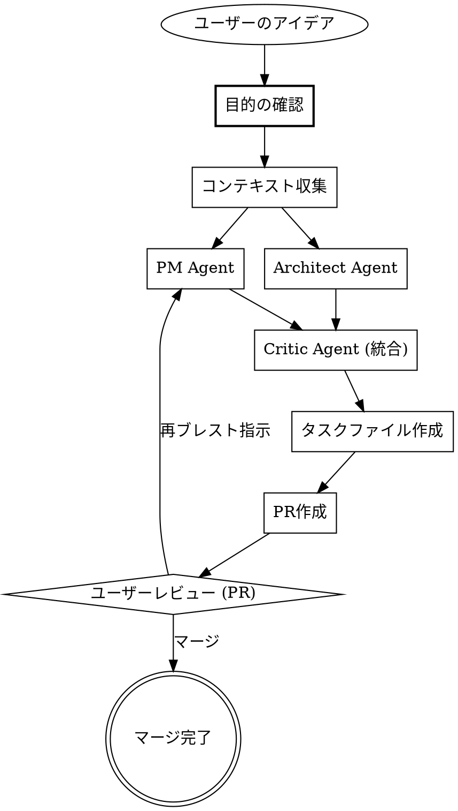

# Task Planning Skill Redesign Implementation Plan

> **For agentic workers:** REQUIRED SUB-SKILL: Use superpowers:subagent-driven-development (recommended) or superpowers:executing-plans to implement this plan task-by-task. Steps use checkbox (`- [ ]`) syntax for tracking.

**Goal:** Redesign `01-tasks-add` and `01-tasks-add-auto` skills from "task enumeration" to "implementation-ready planning" with rich Obsidian output.

**Architecture:** Three skill files are modified: `01-tasks-add` gets a new template that captures full user conversation content; `01-tasks-add-auto` gets a new template that captures all 3-agent discussion plus a PR-based approval flow; `01-tasks` router gets updated triggers and descriptions. No changes to frontmatter schema, agent prompts, or other skills.

**Tech Stack:** Markdown skill files, git, gh CLI

**Spec:** `docs/superpowers/specs/2026-03-22-task-planning-skill-redesign.md`

---

## File Map

| Action | File | Responsibility |
|--------|------|---------------|
| Modify | `/Users/naoki/.claude/skills/01-tasks-add/SKILL.md` | Conversational planning skill — rewrite template and add conversation tracking instructions |
| Modify | `/Users/naoki/.claude/skills/01-tasks-add-auto/SKILL.md` | AI agent planning skill — rewrite template, replace terminal review with PR flow |
| Modify | `/Users/naoki/.claude/skills/01-tasks/SKILL.md` | Router — update descriptions, triggers, routing table |
| Modify | `/Users/naoki/dotfiles/claude/skills/tasks-add/SKILL.md` | Dotfiles copy of tasks-add — sync with active version |

---

### Task 1: Rewrite `01-tasks-add` skill

**Files:**
- Modify: `/Users/naoki/.claude/skills/01-tasks-add/SKILL.md` (full file)

This task rewrites the entire SKILL.md. The key changes:
1. Frontmatter: update description and add trigger keywords
2. Positioning: redefine as "conversational planning + task creation"
3. Add explicit instruction to track ALL conversation content for output
4. Replace minimal template with the rich planning template from spec
5. Add principle: "do not write anything not discussed in conversation"

- [ ] **Step 1: Read current file to confirm state**

Read `/Users/naoki/.claude/skills/01-tasks-add/SKILL.md` and verify it matches the "before" state in the spec (description = `Use when the user wants to create or break down a new work item...`).

- [ ] **Step 2: Rewrite the full file**

Replace the entire content of `/Users/naoki/.claude/skills/01-tasks-add/SKILL.md` with:

```markdown
---
name: 01-tasks-add
description: Use when the user wants to plan and create a new work item through conversation. Triggers on "やること追加", "分解して", "具体化して", "どう進めればいい", "タスクに落として", "break down", "clarify steps", "プランニング", "計画して".
---

# Add Task (Conversational Planning)

Obsidian vault (`/Users/naoki/naoki/02_obsidian-vault`) にタスクファイルを追加する。
ユーザーとの対話がプランニング過程そのもの。会話で出た内容をすべて構造化して出力する。

## 原則

- **会話で出た内容をすべて記録する** — 背景、動機、スコープ判断、技術的議論、却下した案、すべて漏らさずタスクファイルに出力する
- **会話に出ていない推測は書かない** — AI が勝手に補完・推測した内容は載せない
- **タスクファイル = 実装可能なプラン** — ファイルを見たエージェントがそのまま実装に着手できるレベルの情報量を目指す

## Before Creating

タスクが曖昧・大きすぎる場合は、先に対話で明確化する:
- **1問ずつ質問**（複数質問を一度に投げない）
- 何を達成したいか / 制約・前提条件 / 完了の基準
- 可能なら選択肢を提示（オープンエンドより答えやすい）
- 十分明確になったらサブタスクに分解してファイル作成に進む

タスクが具体的ならこのステップをスキップして直接作成する。

## 会話内容の追跡

対話中に以下の情報を追跡し、最終的にテンプレートの各セクションに流し込む:

- **背景・目的**: ユーザーが語った動機、課題、なぜこのタスクが必要か
- **スコープ**: やると合意したこと、やらないと明示的に除外したこと
- **設計判断**: 検討した選択肢、決定事項とその理由、却下した代替案
- **各タスクの詳細**: 目的、具体的な作業内容、技術的な注意点、完了条件
- **前提条件・依存関係**: 確認した前提や他タスクとの依存
- **補足**: セクションに収まらない情報（参考URL、関連する既存実装など）

## Steps

1. 最新化:
   ```bash
   cd /Users/naoki/naoki/02_obsidian-vault && git pull
   ```

2. 対象ディレクトリで最大番号を確認:
   ```bash
   ls /Users/naoki/naoki/02_obsidian-vault/tasks/{project-name}/
   ```
   - ディレクトリがなければ作成
   - 横断TODO: `tasks/_global/`

3. タスクファイルを作成:
   - Path: `tasks/{project-name}/{NNN}-{slug}.md`
   - NNN = 最大番号 + 1（3桁ゼロ埋め）
   - 内容は会話で追跡した情報をテンプレートに流し込む

4. コミット&プッシュ:
   ```bash
   /Users/naoki/naoki/02_obsidian-vault/scripts/write-and-push.sh "task({project}): {slug}"
   ```

## Task File Template

```yaml
---
title: "タスクグループのタイトル"
date: YYYY-MM-DD
project: project-name
status: todo
progress: 0/N
priority: high
tags: []
---
```

```markdown
## 背景・目的

なぜこのタスクが必要になったか。ユーザーが語った動機・課題をそのまま記録する。

## スコープ

### やること
- 会話で合意した作業範囲

### やらないこと
- 会話で明示的に除外したもの

## 設計判断

会話の中で検討・決定した設計上の選択。
- 決定事項とその理由
- 検討したが却下した代替案（会話で出た場合）

## タスク

- [ ] サブタスク1
- [ ] サブタスク2

## 各タスクの詳細

### サブタスク1: {名前}

- **目的**: 何を達成するか
- **やること**: 具体的な作業内容
- **技術的ポイント**: 会話で議論した技術的な注意点
- **完了条件**: 何をもって完了とするか

（会話で議論した粒度に応じて項目は増減する）

### サブタスク2: {名前}
（同上）

## 前提条件・依存関係

会話で確認した前提や依存。

## 補足

会話で出たがセクションに収まらない情報（参考URL、関連する既存実装の話など）
```

各セクションは会話で該当する内容がなければ省略可。

## Checkbox Notation

- `- [ ]` — 未着手
- `- [/]` — 進行中
- `- [x]` — 完了

## Common Mistakes

- 番号の確認漏れ — 対象ディレクトリ内のファイルを確認して採番する
- frontmatter フィールドの省略 — tags が空でもフィールド自体は残す
- 会話に出ていない内容を補完する — ユーザーが語っていない推測や補足を勝手に追加しない
- プランニング過程の省略 — 「設計判断」「スコープ」など、会話で議論した内容を漏らさず記録する
```

- [ ] **Step 3: Verify the rewrite**

Read the file back and verify:
- Frontmatter description matches spec's "after" value
- 原則セクションが3つの原則を含む
- 会話内容の追跡セクションが存在する
- テンプレートに背景・目的、スコープ、設計判断、各タスクの詳細、前提条件、補足セクションが含まれる
- Common Mistakes に新しい2項目が追加されている

- [ ] **Step 4: Commit**

```bash
cd /Users/naoki/.claude && git add skills/01-tasks-add/SKILL.md && git commit -m "feat(01-tasks-add): rewrite as conversational planning skill

Redefine from task enumeration to implementation-ready planning.
Output all user conversation content to Obsidian task file."
```

---

### Task 2: Rewrite `01-tasks-add-auto` skill

**Files:**
- Modify: `/Users/naoki/.claude/skills/01-tasks-add-auto/SKILL.md` (full file)

This task rewrites the entire SKILL.md. The key changes:
1. Frontmatter: update description and add trigger keyword
2. Positioning: redefine as "AI agent planning"
3. Replace Step 4 (terminal presentation) with PR flow
4. Replace Step 5 (terminal review) with PR-based review
5. Replace minimal template with the rich planning template from spec
6. Add Critic 議論ログ section to template

- [ ] **Step 1: Read current file to confirm state**

Read `/Users/naoki/.claude/skills/01-tasks-add-auto/SKILL.md` and verify it matches the "before" state (description = `Use when the user wants to auto-brainstorm and create tasks with AI agents...`).

- [ ] **Step 2: Rewrite the full file**

Replace the entire content of `/Users/naoki/.claude/skills/01-tasks-add-auto/SKILL.md` with:

```markdown
---
name: 01-tasks-add-auto
description: Use when the user wants AI agents to plan and create tasks through automated brainstorming. Triggers on "タスク自動追加", "自動ブレスト", "AI でタスク作って", "auto task", "brainstorm task", "タスクをAIで具体化", "アイデアをタスクにして", "AIプランニング".
---

# Auto Task Add (AI Planning)

Obsidian vault (`/Users/naoki/naoki/02_obsidian-vault`) にタスクファイルを追加する。
`01-tasks-add` との違い: 人間への対話的質問の代わりに、AI 3エージェントが自動ブレストしてタスクのプランニングを行う。
エージェント間の議論がプランニング過程そのもの。議論内容をすべて構造化して Obsidian に出力する。

## 原則

- **エージェントの議論をすべて記録する** — PM の判断ログ、アーキテクトの技術調査メモ、Critic の裁定過程をすべてタスクファイルに出力する
- **タスクファイル = 実装可能なプラン** — ファイルを見たエージェントがそのまま実装に着手できるレベルの情報量を目指す
- **PRで承認を待つ** — ユーザーが内容を確認していないため、直接コミットではなくPRを出す

## Overview



## Step 1: 目的の確認（人間に質問）

AI ブレストに入る前に、ユーザーに**1問だけ**質問して目的を明確にする。
ブレストの方向性を大きく外さないための最低限のアラインメント。

質問例:
> このタスクで一番達成したいことは何ですか？
> （例: 「○○の自動化」「△△の品質向上」「□□の導入検証」など、一言で）

- **1問だけ**聞く（複数質問を投げない）
- 目的が既に明確な場合（ユーザーの入力に具体的なゴールが含まれている場合）はスキップ可
- ユーザーの回答は、以降のすべてのエージェントに追加コンテキストとして渡す

## Step 2: コンテキスト収集

ユーザーの入力から以下を特定する:
- **アイデア/やりたいこと**: ユーザーの発言そのもの
- **プロジェクト**: 明示されていれば使う。不明なら `_global`
- **対象リポジトリ**: 明示されていれば使う。不明なら vault 自体

対象リポジトリがある場合、Explore Agent で構造を把握:
```
Agent(subagent_type=Explore):
  "{repo_path} のディレクトリ構造、主要ファイル、README の概要を把握してください"
```

## Step 3: AI ブレスト (3-Agent Team)

PM Agent と Architect Agent を**並列**実行し、両方の出力が揃ったら Critic Agent が統合する。

**実行順序:**
1. PM Agent + Architect Agent → **同時に** Agent tool を呼ぶ（1つのメッセージで2つの Agent tool call）
2. 両方の結果が返ってきたら → Critic Agent を実行

### PM Agent (model: sonnet, 並列実行 1/2)

```
prompt: |
  あなたはPM（プロダクトマネージャー）です。
  以下のアイデアについて、実行可能なタスクに落とすための要件を整理してください。

  ## ユーザーのアイデア
  {ユーザーの入力全文}

  ## ユーザーが確認した目的
  {Step 1 で確認した目的（スキップした場合はユーザーの入力から推定した目的）}

  ## プロジェクトコンテキスト
  {リポジトリ構造、既存タスク一覧など}

  ## 出力ルール
  - 思考過程を省略しないこと。「なぜそう判断したか」の理由付けを各項目に含める
  - 検討した代替案があれば「却下した選択肢とその理由」も明記する
  - ユーザーの言葉を引用しながら要件に落とすこと

  ## 出力フォーマット
  ### 判断ログ
  アイデアを読んで最初に考えたこと、気になった点、判断の分岐点を自由記述で書く。
  箇条書きではなく、思考の流れが伝わる文章で。

  ### 要件定義
  - 目的: このタスクで何を達成するか（なぜそう定義したかの理由付き）
  - スコープ: 何をやるか / 何をやらないか（境界線の判断理由も）
  - 成功基準: 完了の条件（具体的・検証可能に）
  - 却下した選択肢: 検討したが採用しなかったアプローチとその理由

  ### サブタスク案
  3-7個の実行可能なステップに分解。各ステップに「なぜこの順序か」の根拠を付ける。

  ### 優先度の提案
  high / medium / low とその理由
```

### Architect Agent (model: sonnet, 並列実行 2/2)

```
prompt: |
  あなたはソフトウェアアーキテクトです。
  以下のアイデアについて、技術的な実現性と構成を独自に検討してください。
  （PM の出力は別途並行して生成中のため、ここでは参照しない）

  ## ユーザーのアイデア
  {ユーザーの入力全文}

  ## ユーザーが確認した目的
  {Step 1 で確認した目的（スキップした場合はユーザーの入力から推定した目的）}

  ## プロジェクトコンテキスト
  {リポジトリ構造、コードベース概要}

  ## 出力ルール
  - 思考過程を省略しないこと。技術選定の「なぜこれを選んだか」を必ず書く
  - 「こうもできるが、こちらを選んだ」という比較検討を含める
  - コードベースの具体的なファイルパスや構造を引用して根拠とする

  ## 出力フォーマット
  ### 技術調査メモ
  コードベースを見て気づいたこと、既存の仕組みとの関連、
  技術的に面白い点や危険な点を自由記述で書く。

  ### 技術的実現性
  各サブタスク候補の難易度と見積もり（S/M/L）。判断根拠も付ける。

  ### アーキテクチャ検討
  - 推奨アプローチ: 技術選定と構成案（比較検討の過程を含む）
  - 依存関係: サブタスク間の順序制約
  - リスク: 技術的リスクと対策
  - 却下した技術案: 検討したが不採用としたアプローチとその理由

  ### サブタスク案（技術観点）
  PM とは独立に、技術的に自然な分解を提案する。
```

### Critic Agent (model: opus, PM + Architect の後に実行)

```
prompt: |
  あなたは批評家（兼モデレーター）です。
  PM とアーキテクトが**独立に**検討した結果を受け取りました。
  両者の視点を突き合わせ、議論を統合し、最終的なタスク構成を提案してください。

  ## ユーザーのアイデア
  {ユーザーの入力全文}

  ## PM の要件定義
  {PM Agent の出力（判断ログ含む全文）}

  ## アーキテクトの技術検討
  {Architect Agent の出力（技術調査メモ含む全文）}

  ## 出力ルール
  - PM とアーキテクトの意見が一致している点、食い違っている点を明示する
  - 食い違いがある場合、どちらの意見を採用したかとその理由を書く
  - 「議事録」のように、誰が何を言い、最終的にどう結論したかの流れが分かる書き方にする

  ## 出力フォーマット
  ### 議論サマリー
  PM とアーキテクトの見解を突き合わせた分析。
  - 合意点: 両者が一致している部分
  - 論点: 意見が分かれた部分と、各者の主張の要約
  - 裁定: 各論点に対する批評家としての判断と根拠

  ### 品質チェック
  - スコープが大きすぎないか（1タスクファイルに収まるか）
  - サブタスクの粒度は適切か（大きすぎず小さすぎず）
  - 見落としている前提条件はないか
  - 過剰な分解になっていないか（YAGNI）
  - 優先度は妥当か

  ### 最終タスク構成案
  - タイトル
  - 概要（2-3文）
  - サブタスクリスト（チェックボックス形式、各項目に根拠を一言添える）
  - 推奨優先度と理由
```

## Step 4: タスクファイル作成 & PR

3エージェントの出力をテンプレートに流し込み、PRを出す。

1. 最新化:
   ```bash
   cd /Users/naoki/naoki/02_obsidian-vault && git pull
   ```

2. 対象ディレクトリで最大番号を確認:
   ```bash
   ls /Users/naoki/naoki/02_obsidian-vault/tasks/{project-name}/
   ```
   - ディレクトリがなければ作成
   - 横断TODO: `tasks/_global/`

3. ブランチ作成:
   ```bash
   cd /Users/naoki/naoki/02_obsidian-vault && git checkout -b task/{project}/{slug}
   ```
   slug はタスクファイルのファイル名 slug と同一（例: `task/42-chatbot/007-a1-capacity-change-navigator`）

4. タスクファイルを作成:
   - Path: `tasks/{project-name}/{NNN}-{slug}.md`
   - NNN = 最大番号 + 1（3桁ゼロ埋め）
   - 内容は Critic の最終案 + 全エージェントの生出力をテンプレートに流し込む

5. コミット:
   ```bash
   cd /Users/naoki/naoki/02_obsidian-vault && git add tasks/ && git commit -m "plan({project}): {slug}"
   ```

6. プッシュ & PR作成:
   ```bash
   cd /Users/naoki/naoki/02_obsidian-vault && git push -u origin task/{project}/{slug}
   gh pr create --title "plan({project}): {slug}" --body "{背景・目的セクションの内容}"
   ```

7. main ブランチに戻る:
   ```bash
   cd /Users/naoki/naoki/02_obsidian-vault && git checkout main
   ```

8. ユーザーにPR URLを提示:
   ```
   プランのPRを作成しました: {PR URL}
   内容を確認してください。修正が必要であれば指示してください。
   ```

## Step 5: ユーザーレビュー (PR)

ユーザーはPR上でプランをレビューする。

- **マージ**: プランが承認された。完了。実装着手は別途ユーザーが指示する
- **修正指示**: ユーザーが会話で修正を指示 → 3エージェントパイプラインを再実行（Step 3）し、結果を同じブランチに新コミットとして追加。最大2回まで。超過時はユーザーに手動修正を依頼

## Task File Template

```yaml
---
title: "{Critic の最終案タイトル}"
date: YYYY-MM-DD
project: project-name
status: todo
progress: 0/N
priority: {PM/Critic の推奨優先度}
tags: []
---
```

```markdown
## 背景・目的

ユーザーのアイデアと確認した目的をそのまま記載。

## 要件定義

PM Agent が整理した要件。
- 目的と定義理由
- スコープ（やること / やらないこと）と境界線の判断理由
- 成功基準

## 技術検討

Architect Agent の技術的分析。
- 技術的実現性と難易度の判断根拠
- 推奨アプローチと比較検討した代替案
- リスクと対策
- 関連する既存コードやファイルパスの引用

## 議論サマリー

Critic Agent による PM・Architect の見解の突き合わせ。
- 合意点
- 意見が分かれた論点と各者の主張
- 裁定と根拠

## 設計判断

議論を経て確定した設計上の選択。
- 採用したアプローチとその理由
- 却下した代替案とその理由

## タスク

- [ ] サブタスク1
- [ ] サブタスク2

## 各タスクの詳細

### サブタスク1: {名前}

- **目的**: 何を達成するか
- **やること**: 具体的な作業内容
- **技術的ポイント**: 難易度、使う技術、注意点
- **対象ファイル**: 変更が必要なファイル（Architect が特定した場合）
- **前提/依存**: 他タスクとの関係
- **完了条件**: 何をもって完了とするか

### サブタスク2: {名前}
（同上）

## 前提条件・依存関係

エージェントが特定した前提や依存。

## 補足

エージェントの議論で出たがセクションに収まらない情報（参考URL、関連する既存実装の話など）

## PM 判断ログ

PM Agent の生の思考過程をそのまま記録。

## アーキテクト技術調査メモ

Architect Agent の生の調査・気づきをそのまま記録。

## Critic 議論ログ

Critic Agent の生の統合・裁定過程をそのまま記録。
「議論サマリー」セクションは Critic の出力から構造化した要約であり、
本セクションは生の出力の全文保存。
```

## Checkbox Notation

- `- [ ]` — 未着手
- `- [/]` — 進行中
- `- [x]` — 完了

## Common Mistakes

- 番号の確認漏れ — 対象ディレクトリ内のファイルを確認して採番する
- frontmatter フィールドの省略 — tags が空でもフィールド自体は残す
- Critic の最終案を無視して PM/Architect の中間出力を使う — 構造化セクション（要件定義、技術検討、設計判断など）は必ず Critic の最終案をベースにする
- エージェントの生出力を省略する — PM 判断ログ、アーキテクト技術調査メモ、Critic 議論ログは省略せずそのまま記録する
- ターミナルにブレスト結果の詳細を表示する — 詳細はPR上で確認してもらう。ターミナルにはPR URLとサマリーだけ提示する
```

- [ ] **Step 3: Verify the rewrite**

Read the file back and verify:
- Frontmatter description matches spec's "after" value with "AIプランニング" trigger added
- 原則セクションが3つの原則（議論をすべて記録、実装可能なプラン、PRで承認）を含む
- Overview の dot graph が PR フローを反映している（ターミナルレビューではなく PR レビュー）
- Step 4 がファイル作成 + PR 作成の統合ステップになっている
- Step 5 が PR ベースのレビューになっている
- テンプレートに背景・目的、要件定義、技術検討、議論サマリー、設計判断、各タスクの詳細、PM判断ログ、アーキテクト技術調査メモ、Critic議論ログが含まれる
- Common Mistakes にターミナル表示に関する注意が追加されている

- [ ] **Step 4: Commit**

```bash
cd /Users/naoki/.claude && git add skills/01-tasks-add-auto/SKILL.md && git commit -m "feat(01-tasks-add-auto): rewrite as AI planning skill with PR flow

Redefine from task enumeration to implementation-ready planning.
Output all 3-agent discussion to Obsidian. Replace terminal review with PR-based approval."
```

---

### Task 3: Update `01-tasks` router skill

**Files:**
- Modify: `/Users/naoki/.claude/skills/01-tasks/SKILL.md`

Update the router's description, triggers, and routing table to reflect the new planning-oriented descriptions.

- [ ] **Step 1: Read current file to confirm state**

Read `/Users/naoki/.claude/skills/01-tasks/SKILL.md` and verify current routing table and triggers.

- [ ] **Step 2: Update frontmatter triggers**

In the frontmatter `description` field, add `"プランニング"`, `"計画して"`, `"AIプランニング"` to the triggers list.

Change:
```
description: Use when the user mentions anything about tasks or the knowledge base. Triggers on "タスク", "task", "TODO", "ナレッジベース", "vault", "Obsidian", "タスク追加", "タスク一覧", "タスク確認", "タスク作成", "TODO作って", "TODO見せて", "タスク完了", "今日のタスク", "ナレッジベース検索", "vault検索", "ナレッジベースに書いて", "vaultに保存", "add task", "list tasks", "update task", "タスク実行", "自律実行", "autorun", "execute", "タスク自動追加", "自動ブレスト", "AIでタスク", "auto task", "brainstorm task".
```

To:
```
description: Use when the user mentions anything about tasks or the knowledge base. Triggers on "タスク", "task", "TODO", "ナレッジベース", "vault", "Obsidian", "タスク追加", "タスク一覧", "タスク確認", "タスク作成", "TODO作って", "TODO見せて", "タスク完了", "今日のタスク", "ナレッジベース検索", "vault検索", "ナレッジベースに書いて", "vaultに保存", "add task", "list tasks", "update task", "タスク実行", "自律実行", "autorun", "execute", "タスク自動追加", "自動ブレスト", "AIでタスク", "auto task", "brainstorm task", "プランニング", "計画して", "AIプランニング".
```

- [ ] **Step 3: Update routing table**

Change the routing table rows:

From:
```
| タスク追加・作成・分解 | 01-tasks-add |
| タスク自動追加・AIブレスト | 01-tasks-add-auto |
```

To:
```
| タスク追加・作成・分解・プランニング | 01-tasks-add |
| タスク自動追加・AIブレスト・AIプランニング | 01-tasks-add-auto |
```

- [ ] **Step 4: Update dot graph labels**

Change the dot graph edge labels:

From:
```
"Determine intent" -> "01-tasks-add" [label="追加・作成・分解"];
"Determine intent" -> "01-tasks-add-auto" [label="自動追加・AIブレスト"];
```

To:
```
"Determine intent" -> "01-tasks-add" [label="追加・作成・分解・プランニング"];
"Determine intent" -> "01-tasks-add-auto" [label="自動追加・AIブレスト・AIプランニング"];
```

- [ ] **Step 5: Verify the changes**

Read the file back and verify:
- Triggers in description include the 3 new keywords
- Routing table has updated labels
- Dot graph has updated labels
- No other changes were made

- [ ] **Step 6: Commit**

```bash
cd /Users/naoki/.claude && git add skills/01-tasks/SKILL.md && git commit -m "feat(01-tasks): add planning trigger keywords to router

Add プランニング, 計画して, AIプランニング to routing table and triggers."
```

---

### Task 4: Sync dotfiles copy of `tasks-add`

**Files:**
- Modify: `/Users/naoki/dotfiles/claude/skills/tasks-add/SKILL.md`

The dotfiles repo has an older copy of the tasks-add skill (named `tasks-add` without the `01-` prefix). Sync it with the updated active version.

- [ ] **Step 1: Read the dotfiles copy**

Read `/Users/naoki/dotfiles/claude/skills/tasks-add/SKILL.md` and confirm it's the old version.

- [ ] **Step 2: Overwrite with updated content**

Copy the content from `/Users/naoki/.claude/skills/01-tasks-add/SKILL.md` to `/Users/naoki/dotfiles/claude/skills/tasks-add/SKILL.md`, but **change the frontmatter `name` field** from `01-tasks-add` to `tasks-add` to match the dotfiles naming convention.

- [ ] **Step 3: Verify the sync**

Read the file back and verify:
- `name: tasks-add` (not `01-tasks-add`)
- All other content matches the active version

- [ ] **Step 4: Commit**

```bash
cd /Users/naoki/dotfiles && git add claude/skills/tasks-add/SKILL.md && git commit -m "feat(tasks-add): sync with 01-tasks-add conversational planning rewrite"
```
